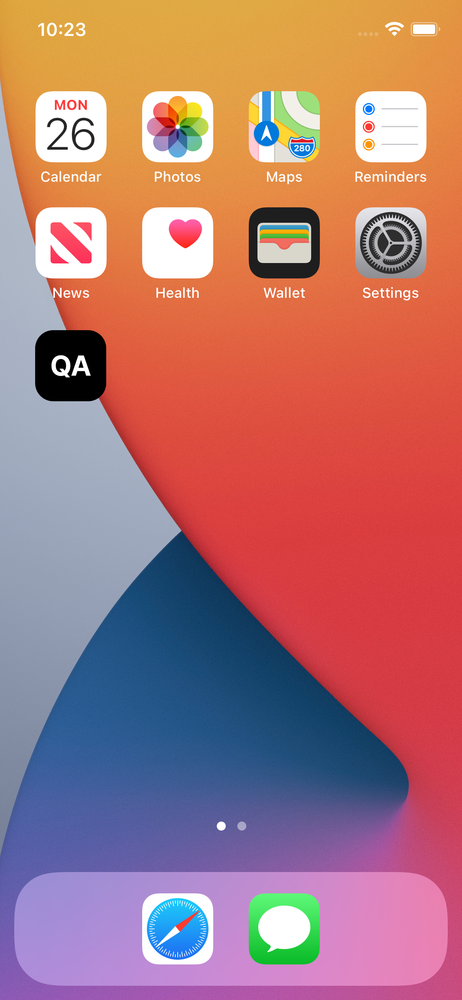

# Expo App Icon & Splash

  

    <strong>Icon</strong> 
    App icons should be **1024px by 1024px**, like the frame below.  
    Try to fit the edges of your design within the outer concentric circles if using a logo as your app icon.
      
    
  

  

    <strong>Adaptive Icon</strong> 
    Adaptive icons are used with Android devices.  
    Try to fit your design within the outer concentric circles if using a logo as your app icon.  
    To use this icon, you’ll need to set the `android.adaptiveIcon.foregroundImage` property in `app.json`.
      
    
  

  

    <strong>Splash</strong> 
    Splash screens are part of the loading sequence.  
    Make your splash screen look exactly like your app’s main page.  
    Avoid putting text, branding, or logos on this screen.
      
    
  

## Previews

  
  
  

